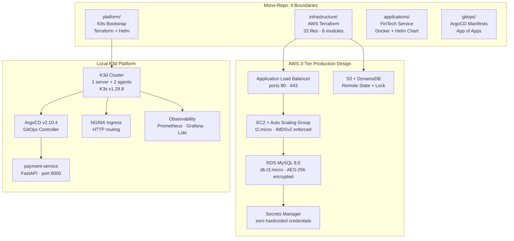
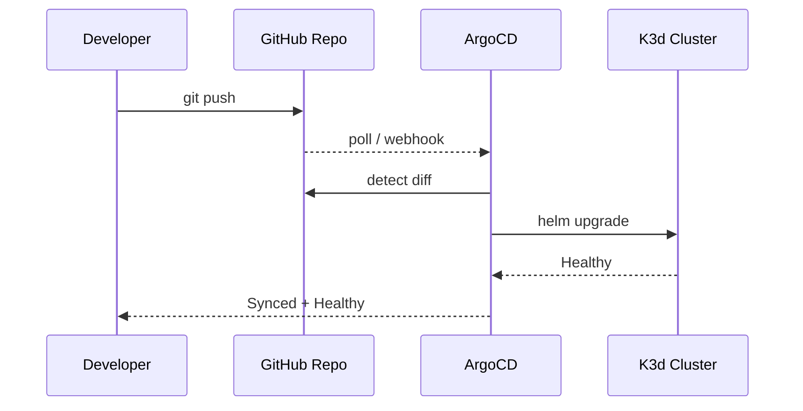
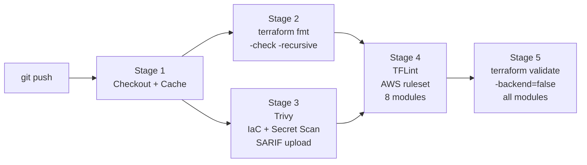
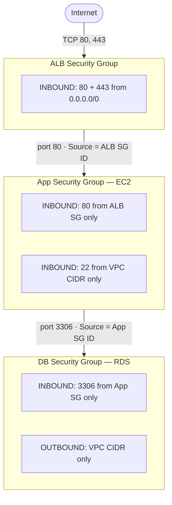
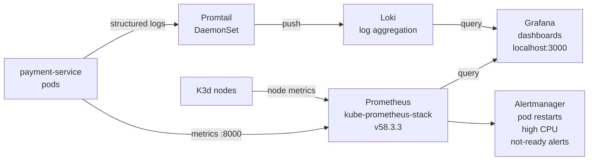
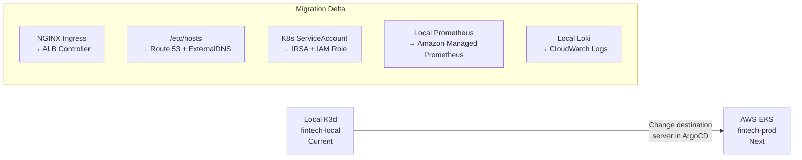
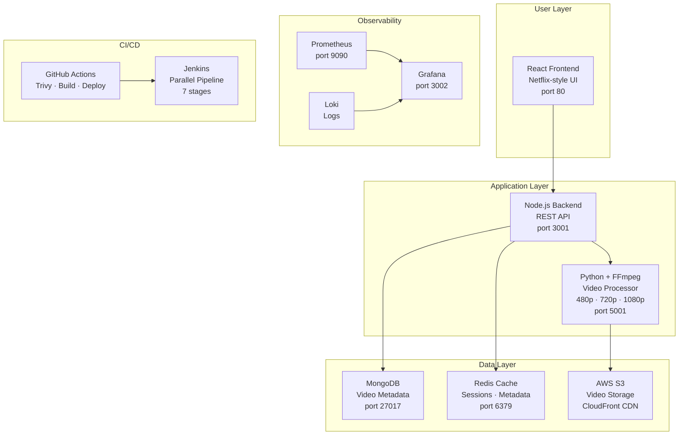

<div align="center">

# Govind
### Junior Platform Engineer · DevOps · Cloud-Native Infrastructure

[](https://github.com/govinddevops)
&nbsp;
[](https://www.linkedin.com/in/goviind-a20ab33b6/)
&nbsp;
[](https://github.com/govinddevops)

</div>

---

## About

Junior Platform Engineer with hands-on experience from a DevOps internship at **Ezdat Technology, Gurugram** and industrial training at **Yamaha, Noida**. I work across infrastructure provisioning, container orchestration, GitOps delivery, and observability.

My focus is on building systems that are operationally maintainable — not just architecturally impressive. I prefer workflows that can be explained clearly, debugged quickly, and handed off to another engineer without a manual.

Currently working on local-first cloud-native platforms that simulate production patterns without cloud spend.

---

## Engineering Focus

- **Infrastructure as Code** — modular Terraform, remote state, multi-environment configuration
- **Container Operations** — multi-stage Docker builds, Kubernetes resource management, Helm chart authoring
- **GitOps Delivery** — ArgoCD App of Apps, automated sync, declarative lifecycle management
- **Observability** — Prometheus alerting, Grafana dashboards, Loki log aggregation
- **DevSecOps Pipelines** — GitHub Actions with static IaC scanning, format enforcement, structural validation
- **Platform Engineering** — Makefile-driven workflows, local cluster simulation, RBAC, NetworkPolicy

---

## Toolchain

| Domain | Tools |
|---|---|
| Cloud | AWS (VPC · EC2 · RDS · ALB · IAM · S3 · Secrets Manager) |
| IaC | Terraform · Helm · Kubernetes manifests |
| Containers | Docker · K3d · K3s · kubectl · Helm |
| GitOps | ArgoCD · GitHub Actions |
| Observability | Prometheus · Grafana · Loki · Alertmanager · Promtail |
| Security | Trivy (Aqua Security) · TFLint · RBAC · NetworkPolicy |
| Languages | Python (FastAPI) · Bash · HCL · YAML |
| CI/CD | GitHub Actions · Jenkins |
| Databases | MySQL · MongoDB · Redis |
| Web | NGINX · Node.js · React |

---

## Featured Projects

---

### 1. Enterprise Zero-Trust GitOps Platform *(Flagship)*

> `aws-enterprise-3tier-infrastructure-iac`

A mono-repo cloud-native platform built in five phases — from AWS infrastructure as code to containerised service delivery via GitOps. Designed local-first to validate production patterns without cloud cost.

#### Architecture Overview



#### GitOps Delivery Flow



#### DevSecOps Pipeline

Every push to `main` runs the full pipeline — zero AWS credentials required:



#### Security Architecture



#### Observability Stack



#### Namespace Topology

| Namespace | Purpose | Contents |
|---|---|---|
| `argocd` | GitOps controller | ArgoCD server · repo-server · application-controller |
| `platform` | Platform layer | NGINX Ingress Controller |
| `apps` | Application layer | payment-service · NetworkPolicy · RBAC |
| `observability` | Observability | Prometheus · Grafana · Alertmanager · Loki · Promtail |
| `security` | Reserved | Future policy enforcement |

#### Security Controls

| Control | Implementation | Standard |
|---|---|---|
| Zero hardcoded credentials | IAM Instance Profile + Secrets Manager | CIS AWS |
| Encryption at rest — EBS | gp3 AES-256 | SOC2 CC6.1 |
| Encryption at rest — RDS | `storage_encrypted = true` | SOC2 CC6.1 |
| Encryption in transit — DB | `require_secure_transport = ON` | PCI-DSS 4.1 |
| IMDSv2 enforced | `http_tokens = required` | CIS AWS 5.6 |
| Least privilege IAM | Scoped ARNs — zero wildcard `*` | ISO 27001 |
| Non-root containers | `runAsUser: 1001` | CIS K8s |
| Read-only filesystem | `readOnlyRootFilesystem: true` | CIS K8s |
| Zero-trust networking | NetworkPolicy deny-all + explicit allow | CIS K8s |

#### Local DNS Mapping

```bash
# /etc/hosts entries (added via make hosts-setup)
127.0.0.1   api.fintech.local       # payment-service API
127.0.0.1   argocd.fintech.local    # ArgoCD UI

# WSL note: use kubectl port-forward as primary access method
# K3d LoadBalancer EXTERNAL-IP stays <pending> on WSL — expected behaviour
kubectl port-forward svc/payment-service 8001:80 -n apps &
kubectl port-forward svc/argocd-server 8080:443 -n argocd &
kubectl port-forward svc/kube-prometheus-stack-grafana 3000:80 -n observability &
```

#### Developer Workflow

| Command | Action |
|---|---|
| `make deps` | Verify all tools installed |
| `make cluster-up` | Create K3d 3-node cluster |
| `make platform-bootstrap` | Deploy namespaces + ArgoCD |
| `make docker-build` | Build payment-service image |
| `make k3d-image-load` | Import image into K3d |
| `make app-deploy` | Helm install to apps namespace |
| `make observability-install` | Deploy Prometheus + Grafana + Loki |
| `make grafana-open` | Port-forward Grafana to :3000 |
| `make argocd-open` | Port-forward ArgoCD UI to :8080 |
| **`make restart`** | **Full restore after PC reboot** |
| `make clean` | Teardown — platform + cluster |

#### Repository Structure

| Path | Description |
|---|---|
| `Makefile` | 20+ operational targets |
| `infrastructure/backend.tf` | S3 remote state · DynamoDB lock |
| `infrastructure/providers.tf` | AWS provider · default_tags |
| `infrastructure/modules/vpc/` | VPC · 6 subnets · IGW · NAT · routes |
| `infrastructure/modules/security_groups/` | 3-tier SG chain · SG-to-SG rules |
| `infrastructure/modules/alb/` | ALB · Target Group · Listener |
| `infrastructure/modules/iam/` | EC2 role · least-privilege policies |
| `infrastructure/modules/compute/` | Launch Template · ASG · CW alarms |
| `infrastructure/modules/rds/` | MySQL 8.0 · Secrets Manager |
| `infrastructure/environments/` | dev · staging · prod tfvars |
| `platform/main.tf` | 5 namespaces + ArgoCD Helm release |
| `applications/payment-service/Dockerfile` | Multi-stage · non-root · OCI labels |
| `applications/payment-service/app/main.py` | FastAPI · /health · /ready · /api/v1/payments |
| `applications/payment-service/helm-chart/` | Chart · values · deployment · service · ingress |
| `gitops/argocd-apps/root-app.yaml` | App of Apps root manifest |
| `gitops/argocd-apps/payment-service-app.yaml` | Application manifest · auto-sync |
| `platform/observability/prometheus-values.yaml` | kube-prometheus-stack config |
| `platform/observability/loki-values.yaml` | Loki + Promtail config |
| `platform/rbac/payment-service-rbac.yaml` | ServiceAccount · Role · NetworkPolicy |
| `production-cloud-manifests/` | EKS · IRSA · ALB Controller blueprints |
| `.github/workflows/devops-pipeline.yml` | 5-stage DevSecOps pipeline |

#### AWS Migration Roadmap



All Helm charts, GitOps manifests, and application code stay identical.
Only destination references and IAM annotations change.

#### Multi-Environment Cost Profile

| Config | Dev | Staging | Production |
|---|---|---|---|
| VPC CIDR | 10.1.0.0/16 | 10.2.0.0/16 | 10.0.0.0/16 |
| EC2 Instances | 1 | 2 | 2 |
| NAT Gateway | Disabled | Enabled | Enabled |
| Deletion Protection | Off | On | On |
| Est. Monthly Cost | ~$16 | ~$48 | ~$48 |

#### Troubleshooting

| Symptom | Cause | Fix |
|---|---|---|
| Cluster not accessible | K3d stopped after reboot | `make restart` |
| `EXTERNAL-IP: <pending>` | WSL LoadBalancer limitation | Normal — use `kubectl port-forward` |
| `context deadline exceeded` | Helm `--wait` on WSL | Pod is running — timeout is cosmetic |
| `webhook certificate error` | Stale validating webhook | `kubectl delete validatingwebhookconfiguration ingress-nginx-admission` |
| `apiVersion not set` | Helm template function error | `helm template` dry-run to debug |
| Pipeline Stage 2 fails | Terraform fmt violations | `terraform fmt -recursive` then push |
| Agent node NotReady | containerd after WSL sleep | `docker restart k3d-fintech-local-agent-0` |

**Stack:** Terraform · AWS · K3d · ArgoCD · Helm · FastAPI · Prometheus · Grafana · Loki · GitHub Actions · Trivy · TFLint · Python · Docker · NGINX · MySQL

[](https://github.com/govinddevops/aws-enterprise-3tier-infrastructure-iac)

---

### 2. Cinemaplex DevOps Pipeline

A Netflix-style video streaming platform with a complete DevOps delivery stack. Built a three-service architecture — React frontend, Node.js backend API, and a Python FFmpeg video processor — deployed on Kubernetes with automated CI/CD.

#### Architecture



**Stack:** React · Node.js · Python · FFmpeg · AWS S3 · CloudFront · MongoDB · Redis · Kubernetes · Jenkins · GitHub Actions · Trivy · Prometheus · Grafana · Loki · NGINX Ingress

**Purpose:** End-to-end DevOps delivery for a multi-service application — demonstrates parallel CI pipelines, container security scanning, multi-replica Kubernetes deployments with HPA, and full observability.

[](https://github.com/govinddevops/cinemaplex-devops-pipeline)

---

### 3. GitOps ArgoCD Delivery Engine

A standalone GitOps delivery platform demonstrating ArgoCD application lifecycle management patterns — App of Apps, multi-environment promotion, and automated rollback on health check failure.

**Stack:** ArgoCD · Helm · Kubernetes · GitHub Actions · Kustomize

**Purpose:** Isolates and demonstrates GitOps delivery patterns independently — sync policies, health checks, automated prune, and self-heal behaviour across multiple application namespaces.

[](https://github.com/govinddevops/gitops-argocd-delivery-engine)

---

### 4. Cloud-Native CI/CD Delivery Platform

A CI/CD platform focused on container-native delivery — multi-stage Docker builds, image scanning, registry push automation, and Kubernetes rolling deployments triggered by pipeline events.

**Stack:** GitHub Actions · Docker · Kubernetes · Trivy · Helm · NGINX

**Purpose:** Demonstrates a complete image build-scan-push-deploy loop with security gates at each stage — practical delivery automation without orchestration overhead.

[](https://github.com/govinddevops/cloud-native-cicd-delivery-platform)

---

## Contact

[](mailto:govindsharma.devops@gmail.com)
&nbsp;
[](https://www.linkedin.com/in/goviind-a20ab33b6/)
&nbsp;
[](https://github.com/govinddevops)

Open to Junior Platform Engineer · DevOps Engineer · Cloud Infrastructure roles.

---

*Automate what can be automated. Monitor what matters. Keep it maintainable.*
